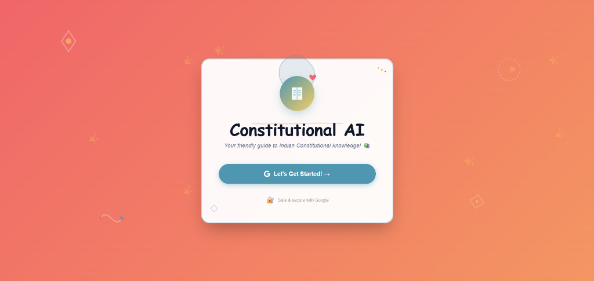
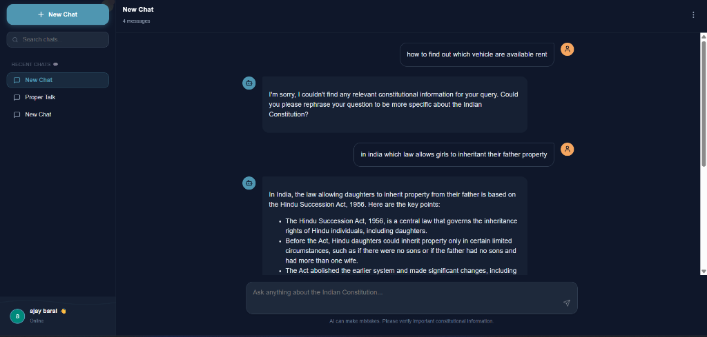

# Constitutional AI Chatbot 🏛️✨

> Your friendly, intelligent companion for exploring the Indian Constitution

[](https://opensource.org/licenses/MIT)
[](https://reactjs.org/)
[](https://nodejs.org/)
[](https://www.mongodb.com/)

---

## 🎨 Beautiful, Human-Friendly Design


*Playful login page with hand-drawn doodles and friendly animations*


*Modern chat interface with organized sidebar and intelligent responses*

---

## ✨ Features

### 🤖 **Intelligent AI Responses**
- Powered by **Mistral-7B-Instruct** via OpenRouter API
- Context-aware answers with constitutional article citations
- Markdown formatting with code highlighting

### 🎨 **Modern, Playful UI**
- Hand-drawn doodles and organic shapes
- Smooth animations with Framer Motion
- Friendly emojis and warm color palette
- ChatGPT-like sidebar with chat organization

### 🔐 **Secure Authentication**
- Google OAuth via Firebase
- User profile management
- Session persistence

### 📁 **Smart Organization**
- Multiple chat conversations
- Folder support for grouping chats
- Pin important conversations
- Search and filter functionality

### 📚 **Constitutional Knowledge Base**
- Comprehensive Indian Constitution database
- Text search with MongoDB
- Article citations and references

---

## 🚀 Quick Start

### Prerequisites
- Node.js (v16+)
- MongoDB
- Google OAuth credentials (Firebase)
- OpenRouter API key

### Installation

1. **Clone the repository**
```bash
git clone <repository-url>
cd constitutional-chatbot
```

2. **Install backend dependencies**
```bash
npm install
```

3. **Install frontend dependencies**
```bash
cd client
npm install
```

4. **Configure environment variables**

Create `.env` in root directory:
```env
MONGODB_URI=mongodb://localhost:27017/constitutional-chatbot
OPENROUTER_API_KEY=your_openrouter_api_key_here
CONSTITUTION_DRIVE_URL=your_google_drive_url_here
```

Create `.env` in `client` directory:
```env
REACT_APP_FIREBASE_API_KEY=your_firebase_api_key
REACT_APP_FIREBASE_AUTH_DOMAIN=your_project.firebaseapp.com
REACT_APP_FIREBASE_PROJECT_ID=your_project_id
REACT_APP_FIREBASE_STORAGE_BUCKET=your_project.firebasestorage.app
REACT_APP_FIREBASE_MESSAGING_SENDER_ID=your_sender_id
REACT_APP_FIREBASE_APP_ID=your_app_id
REACT_APP_FIREBASE_MEASUREMENT_ID=your_measurement_id
```

5. **Start the application**

Backend server:
```bash
npm start
```

Frontend (in separate terminal):
```bash
cd client
npm start
```

Access at: **http://localhost:3000**

---

## 🛠️ Tech Stack

### Frontend
- **React 18** - UI framework
- **Material-UI** - Component library
- **Framer Motion** - Smooth animations
- **Lucide React** - Modern icons
- **React Markdown** - Markdown rendering
- **Firebase Auth** - Authentication

### Backend
- **Node.js** - Runtime environment
- **Express.js** - Web framework
- **MongoDB** - Database
- **Mongoose** - ODM
- **OpenRouter API** - AI model integration

---

## 📂 Project Structure

```
constitutional-chatbot/
├── client/                 # React frontend
│   ├── src/
│   │   ├── components/    # React components
│   │   │   ├── LoginPage.jsx
│   │   │   ├── Sidebar.jsx
│   │   │   └── ChatArea.jsx
│   │   ├── App.js         # Main app component
│   │   ├── firebase.js    # Firebase config
│   │   └── index.css      # Global styles
│   └── package.json
├── models/                 # MongoDB models
│   ├── Chat.js
│   ├── Folder.js
│   ├── Constitution.js
│   └── User.js
├── routes/                 # API routes
│   ├── authRoutes.js
│   ├── chatRoutes.js
│   ├── folderRoutes.js
│   └── constitutionRoutes.js
├── data/                   # Constitution data
├── screenshots/            # App screenshots
├── server.js              # Express server
└── package.json
```

---

## 🎯 Key Capabilities

### Chat Management
- Create multiple chat conversations
- Rename and delete chats
- Pin important discussions
- Search through chat history

### Folder Organization
- Create folders to organize chats
- Move chats between folders
- Color-code folders

### AI Features
- Ask questions about Indian Constitution
- Get detailed explanations with article references
- Structured responses with bullet points
- Code syntax highlighting for examples

---

## 🔧 API Endpoints

### Authentication
- `POST /api/auth/google` - Google authentication
- `GET /api/auth/profile/:userId` - Get user profile
- `POST /api/auth/logout/:userId` - Logout

### Chat
- `POST /api/chat/chats` - Create new chat
- `GET /api/chat/chats` - List all chats
- `GET /api/chat/chats/:chatId` - Get specific chat
- `POST /api/chat/chats/:chatId/message` - Send message
- `PUT /api/chat/chats/:chatId` - Rename chat
- `DELETE /api/chat/chats/:chatId` - Delete chat
- `PUT /api/chat/chats/:chatId/pin` - Toggle pin status

### Folders
- `POST /api/folders` - Create folder
- `GET /api/folders` - List folders
- `PUT /api/folders/:folderId` - Update folder
- `DELETE /api/folders/:folderId` - Delete folder

---

## 🎨 Design Philosophy

This chatbot embraces a **human-centered design** approach:

✨ **Playful & Friendly** - Hand-drawn doodles, sparkles, and warm colors  
💝 **Approachable** - Comic Sans font and friendly copy  
🎭 **Organic** - Flowing shapes and smooth animations  
📚 **Educational** - Clear, structured responses with emojis  

The goal is to make constitutional knowledge accessible and enjoyable!

---

## 🤝 Contributing

Contributions are welcome! Please feel free to submit a Pull Request.

1. Fork the repository
2. Create your feature branch (`git checkout -b feature/AmazingFeature`)
3. Commit your changes (`git commit -m 'Add some AmazingFeature'`)
4. Push to the branch (`git push origin feature/AmazingFeature`)
5. Open a Pull Request

---

## 📝 License

This project is licensed under the MIT License.

---

## 🙏 Acknowledgments

- **Mistral AI** for the Mistral-7B-Instruct model
- **OpenRouter** for API access
- **Firebase** for authentication services
- **MongoDB** for database solutions

---

## 📧 Support

For questions or issues, please create an issue in the GitHub repository.

---

**Made with ❤️ for understanding the Indian Constitution**